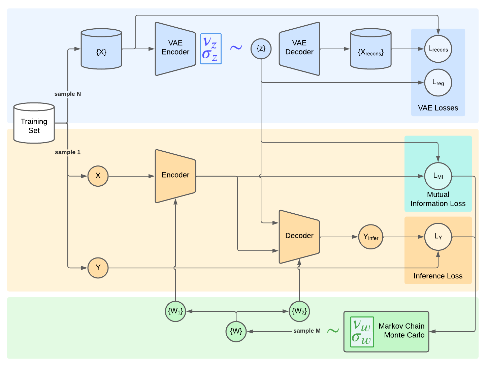

# Causal Bayesian Neural Network

Repository of the Causal Bayesian Neural Network (CBNN).


# Installation

Run the following command to install the required packages:
```bash
pip install -r requirements.txt
```

You can install the packages in a virtual environment by running the following commands:
```bash
python -m venv venv
source venv/bin/activate
pip install -r requirements.txt
```


# Download data

The data used in the experiments are not included in the repository due to their large memory footprint. They are either automatically downloaded when the dataset is used or they must be downloaded separately, as indicated in the next table. The data can be downloaded from the following links:

| Dataset         | Split | Requires download    | Link                                                                                                          | File ID                                |
|-----------------|-------|----------------------|---------------------------------------------------------------------------------------------------------------|----------------------------------------|
| MNIST           |       |  auto                | [torchvision documentation](https://pytorch.org/vision/main/generated/torchvision.datasets.MNIST.html)        |                                        |
| CIFAR10         |       |  auto                | [torchvision documentation](https://pytorch.org/vision/master/generated/torchvision.datasets.CIFAR10.html)    |                                        |
| ACRE            | IID   |  yes                 | [project homepage](https://wellyzhang.github.io/project/acre.html)                                            | 1P0WBnnjWolGsrATUQtx4ictiYlOGc-OT      |
|                 | Comp  |  yes                 |                                                                                                               | 1-LZMt08a1v-KSuaQTS1lqD6BCEw47LEY      |
|                 | Comp  |  yes                 |                                                                                                               | 1Sn_tKbe6mMv7Tc_y6hJZnm7lSenjwIys      |
| CONCEPTARC      |       |  auto                | [github page](https://github.com/victorvikram/ConceptARC)                                                     |                                        |
| RAVEN           | IID   |  yes                 | [project homepage](https://wellyzhang.github.io/project/raven.html)                                           | 111swnEzAY2NfZgeyAhVwQujMjRUfeyuY      |
|                 | OOD   |  no (requires IID)   |                                                                                                               |                                        |


Download the data using the following command:
```bash
gdown <file_id>
```
`file_id` is the ID of the zip file in google drive, indicated in the last column. The zip must be placed in the corresponding `data/<dataset_name>` folder and unzipped:
```bash
cd data/<dataset_name>
unzip <file_name>.zip
```


# Test

To run the tests, use the following command:
```bash
pytest
```
Make sure the data is properly downloaded before running the tests. Running the tests should take a couple minutes depending on your config.


# Usage

To run the experiments from a config file, use the following command: 
```bash
python run.py --load_config 'config/<config_file>.yaml' '<model_name>'
```

You can also pass arguments directly to the script:
```bash
python run.py --<parameter> '<value>' '<model_name>' --<model_parameter> '<value>'
```

Use the `-h` flag to see the available options:
```bash
python run.py -h
```

To see the model options, use the following command:
```bash
python run.py '<model_name>' -h
```

Common arguments:
- `--load_config`: Load the configuration file.
- `--save_config`: Save the configuration file.
- `--data`: Dataset to use.
- `--save`: Path to save the model.
- `--train`, `--test`, `--train_and_test`: Train, test, or train and test the model. Default option is `train_and_test`.
- `--max_epochs`: Maximum number of epochs. You might want to set it as the default value of Pytorch Lightning is 1000.


## Hyperparameter search

To run a hyperparameter search, use the following command:
```bash
python hyp_search.py
```
You can use the same arguments as in the `run.py` script. Please, be aware that the Ray Tune trials are run in a different working directory: the path arguments must be absolute and the logging files are saved in a different directory (check `Ray Tune` documentation for more information).


## Architecture
